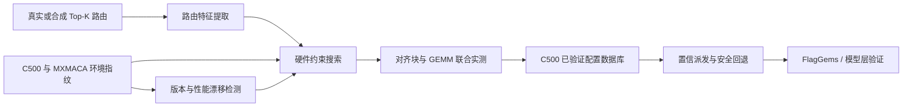

# 青年开源专项基金种子计划项目申报书

## 一、基本信息

- 项目名称：MXMoE-Adapt：面向沐曦曦云 C500 的路由负载感知 MoE 融合算子协同优化与自适应派发
- 英文名称：MXMoE-Adapt: Route-aware MoE Optimization and Adaptive Dispatch for MetaX C500
- 申报层级：重点级开源项目
- 所属方向：AI Infra；MXMACA 生态适配；国产算力适配；大模型推理优化；AI 编译器与算子优化
- 开源许可证：Apache License 2.0
- 代码托管：GitHub/Gitee（公开）并按要求同步至 GitLink
- 申报方式：个人申报
- 项目负责人：李勇志
- 所在单位：哈尔滨理工大学
- 团队成员：李勇志（核心维护者）
- 联系方式：提交至主办方私密表单，不在公开仓库披露

## 二、项目摘要

本项目面向沐曦曦云 C500 与 MXMACA 软件栈，研发路由负载感知的 MoE 融合算子协同优化与自适应派发系统。针对通用 MoE 算子在不同专家负载、Prefill/Decode 阶段及国产 GPU 环境中存在固定参数适应性不足、专家对齐填充浪费、软件版本变化后配置失效和性能结果难以复现等问题，项目将联合优化路由对齐块、专家 GEMM 分块与运行时配置选择，构建 C500 环境指纹、真实路由特征数据集、离线自动调优器、版本化配置数据库及置信派发机制。项目将在真实 C500 环境完成 FP16/BF16 正确性、算子性能和稀疏 MoE 模型验证，并向 FlagGems 提交 MetaX 后端贡献，形成可复现、可维护、可持续演进的国产算力开源成果。

## 三、立项背景与问题

MoE 推理的专家计算由动态 Top-K 路由驱动。即便矩阵维度相同，不同请求也可能产生完全不同的专家负载：部分专家过载、部分专家为空，经过块对齐后又会引入额外填充。因此，只根据总 token 数和平均 token/expert 选择固定 GEMM Tile，无法稳定覆盖 Decode、Prefill 以及路由偏斜场景。

FlagGems 已提供通用 Fused MoE 实现和 MetaX 后端框架，但截至项目立项时公开的 MetaX 专用 `fused/` 目录中尚未形成 C500 专用 Fused MoE 实现。通用实现缺少匹配设备配置时会回落到默认启发式策略。由此形成了明确的开源切入点：不重复“让 FlagGems 在沐曦上运行”的已有工作，而是建立面向 C500 的 MoE 性能适配、验证和配置生命周期机制。

项目与种子计划重点支持的 MXMACA 生态适配、国产算力适配、大模型推理优化及算子优化方向直接一致。

## 四、项目目标

1. 建立 C500/MXMACA 可复现环境指纹与只读采集工具。
2. 建立覆盖 Decode、路由偏斜和 Prefill 的 MoE 路由特征与 Shape 基准。
3. 实现路由对齐块与专家 GEMM 参数的硬件约束联合搜索。
4. 建立只使用 C500 实测数据的版本化配置数据库和置信派发机制。
5. 完成单卡 C500 FP16/BF16 正确性与性能验证。
6. 完成至少一个真实稀疏 MoE 模型的层级验证及可复现实验报告。
7. 向 FlagGems 提交 MetaX 后端 Issue/PR，并持续维护独立仓库。

## 五、主要创新点

### 创新一：从 Shape 感知升级为路由分布感知

引入每专家 token 计数、空专家比例、最大/平均负载、变异系数、归一化路由熵等特征，将相同 Shape 下的不同动态路由区分为 `decode_sparse`、`skewed` 和 `prefill_dense` 等类型，避免平均值掩盖真实负载。

### 创新二：路由对齐与专家 GEMM 联合优化

设专家 `e` 获得的 token 数为 `c_e`，对齐块为 `a`，填充率为：

```text
P(a) = sum(ceil(c_e / a) * a) / sum(c_e) - 1
```

本项目不将路由对齐和 GEMM 独立调优，而是联合搜索 `a`、`BLOCK_SIZE_M/N/K`、`GROUP_SIZE_M`、warps 和 stages，以实测延迟、填充率及编译成本构成联合目标。该方法能够揭示“大Tile计算效率更高但填充浪费更大”的权衡。

### 创新三：带置信度的运行时安全派发

配置数据库只接受 C500 真机验证记录。运行时根据 dtype、Shape、路由类型和环境指纹计算匹配距离；当输入超出实测覆盖或软件版本不匹配时，自动回退 FlagGems 通用实现，避免将实验配置无条件用于生产。

### 创新四：面向国产软件栈演进的漂移检测

MXMACA、Driver、mcPytorch、mcTriton/FlagTree 和 FlagGems 版本变化均可能改变最优配置。项目为每份结果生成环境指纹，并设置守护 Shape；当环境变化或延迟回退超过阈值时，自动将配置标记为待重新调优。

### 创新五：证据化、可复现的算子发布方式

每个性能结论必须绑定硬件与软件版本、代码提交、模型 Shape、路由统计、随机种子、正确性误差、预热次数和计时方法。配置、原始 JSON 和汇总报告可互相追溯，解决国产算力性能结果常见的不可复现问题。

### 创新六：反事实路由回放与多保真调优

从真实模型采集并脱敏保存 Top-K expert IDs，所有候选Kernel复用完全相同的路由结果，避免路由随机性掩盖算子差异。调优采用“资源代理过滤—小Shape编译—合成路由—真实路由回放—模型层验证”的多保真路径，将昂贵C500真机时间集中在最有希望的候选上。

## 六、技术路线



技术实施分为五层：环境与数据层、基准层、搜索层、派发层、集成与验证层。公共 CI 负责数据结构、路由特征和派发逻辑；C500 真机作为性能发布门禁，硬件结果不能由其他 GPU 替代。

## 七、已有基础

申报仓库已形成首个可运行版本，包括：

- C500/MXMACA 环境采集与环境指纹；
- 路由熵、偏斜、空专家比例与填充率计算；
- C500 资源约束的联合搜索空间生成器；
- 版本化配置数据库、距离选择和安全回退；
- 环境及性能漂移检测；
- PyTorch Reference 与 FlagGems Fused MoE 基准适配器；
- CPU 单元测试和持续集成配置；
- C500 实测流程及结果发布规范。

当前仓库不包含未经 C500 实测的性能结论，示例配置均显式标注 `verified=false`。

## 八、验收指标

### 必须完成

- 单卡曦云 C500；FP16/BF16；不少于 30 组 Shape/路由组合。
- PyTorch Reference、原始 FlagGems 和优化实现三套基线完整保留。
- 典型 Shape 正确性通过，误差阈值按 dtype 和上游测试口径确定并公开。
- 所有发布配置包含环境指纹且 `verified=true`。
- 发布开源仓库、使用文档、实测报告和可复现命令。
- 至少提交一个 FlagGems MetaX 后端 Issue 或 PR。

### 目标指标（须以真机实测为准）

- 相对 FlagGems 通用默认实现，典型 Shape 几何平均延迟降低不低于 20%。
- Decode 关键 Shape 延迟降低目标不低于 30%。
- MoE 层端到端延迟降低目标不低于 15%。
- 模型端到端吞吐提升目标不低于 10%。
- 运行时派发开销低于算子耗时的 1%。

目标指标不是既有结果；若实测未达到，将完整公开负结果、瓶颈分析和后续优化计划。

## 九、进度计划

- T0—T0+2周：环境固化、基线、正确性与路由采集。
- T0+3—5周：联合搜索、调优数据结构和首批配置。
- T0+6—8周：Decode/Prefill 两类 C500 优化路径。
- T0+9—10周：运行时派发、漂移检测及 FlagGems 接入。
- T0+11周：真实模型层级与端到端验证。
- T0+12周：上游 PR、文档、复现实验及首个正式版本。

## 十、经费使用建议

重点级 12000 元建议按以下方式编制，最终以主办方财务口径为准：

- C500 算力环境使用及长时间调优：6000 元。
- 测试、存储与结果归档基础设施：1800 元。
- 开源文档、发布与可复现材料：1200 元。
- 社区协作、技术交流与成果推广：1800 元。
- 跨版本复测及兼容性验证：1200 元。

## 十一、风险与控制

- **C500 访问不稳定**：先完成CPU逻辑和小Shape冒烟；正式性能发布必须通过真机门禁。
- **软件版本不一致**：环境指纹进入结果主键，禁止跨版本直接比较。
- **搜索空间过大**：先用资源约束过滤，再采用分阶段搜索和早停。
- **模型Shape变化**：从运行时采集真实Shape，不将示例Shape写成模型事实。
- **上游API变化**：FlagGems通过独立适配器隔离，固定提交后验证。
- **性能目标未达到**：公开原始数据和原因，不隐藏负结果，不伪造加速比。

## 十二、开源与社区计划

项目采用 Apache-2.0 许可证，公开路线图、Issue模板、贡献规范和版本记录。首个稳定版本完成后向 FlagGems 发起 MetaX 后端贡献，并同步至 GitLink。后续在不破坏首期交付的前提下扩展 FP8/W8A8、Expert Parallel 和其他曦云设备。

## 十三、参考链接

- 青年开源专项基金种子计划：https://www.metax-tech.com/ndetail/12622.html
- FlagGems：https://github.com/flagos-ai/FlagGems
- FlagGems MetaX 后端：https://github.com/flagos-ai/FlagGems/tree/master/src/flag_gems/runtime/backend/_metax
